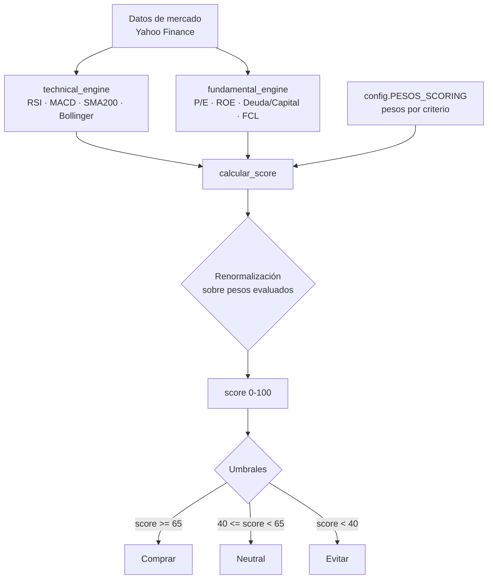

# Validación empírica del motor de scoring

> Documento de soporte a la memoria técnica. Describe la metodología y los
> resultados de la validación empírica del motor de scoring determinista, así
> como el diagrama del flujo de decisión y el análisis de sensibilidad de los
> pesos. Script reproducible: [`scripts/backtest.py`](scripts/backtest.py).
> Pruebas asociadas: [`tests/test_sensibilidad_pesos.py`](tests/test_sensibilidad_pesos.py).

## 1. Objetivo

Aportar evidencia de que la recomendación (Comprar / Neutral / Evitar) que
produce el motor de scoring es **estable y robusta**, y que no depende de un
ajuste arbitrario de los pesos. La validación usa el motor real
(`domain/scoring_engine.py`) y los pesos reales (`config.PESOS_SCORING`).

## 2. Flujo de decisión del motor de scoring

El motor **excluye** los criterios que no puede evaluar (datos ausentes) y
**renormaliza** el score sobre los pesos realmente aplicados, de modo que no
penaliza a un valor por falta de datos.

## 3. Metodología

1. Se toma una fotografía real de indicadores técnicos y fundamentales (FY2025,
   datos de Yahoo Finance del 19/06/2026) de tres valores de referencia: AAPL,
   MSFT y GOOGL.
2. Se calcula el score con los **pesos base** del proyecto.
3. Se repite el cálculo bajo **cuatro escenarios de ponderación** distintos para
   medir la sensibilidad del resultado:
   - Base (pesos del proyecto)
   - Igualitario (12,5 puntos por criterio)
   - Pro-técnico (60 % técnico / 40 % fundamental)
   - Pro-fundamental (20 % técnico / 80 % fundamental)
4. Se comprueba si el **ranking** entre valores se mantiene en todos los
   escenarios (criterio de robustez).

## 4. Resultados con los pesos base

| Ticker | Score | Recomendación | Criterios cumplidos |
|--------|------:|---------------|---------------------|
| AAPL   | 78,0  | **Comprar**   | RSI, MACD, precio>SMA200, ROE, deuda/capital, FCL |
| GOOGL  | 78,0  | **Comprar**   | RSI, MACD, precio>SMA200, ROE, deuda/capital, FCL |
| MSFT   | 54,0  | Neutral       | RSI, ROE, deuda/capital, FCL |

## 5. Análisis de sensibilidad de los pesos

| Escenario | AAPL | MSFT | GOOGL |
|-----------|-----:|-----:|------:|
| Base (proyecto)         | 78,0 Comprar | 54,0 Neutral | 78,0 Comprar |
| Igualitario (12,5 c/u)  | 75,0 Comprar | 50,0 Neutral | 75,0 Comprar |
| Pro-técnico (60/40)     | 75,0 Comprar | 45,0 Neutral | 75,0 Comprar |
| Pro-fundamental (20/80) | 75,0 Comprar | 65,0 Comprar | 75,0 Comprar |

## 6. Conclusiones

- **Ranking estable:** en los cuatro escenarios el orden es siempre
  `AAPL ≈ GOOGL > MSFT`. La ponderación elegida en el proyecto no fuerza el
  resultado: la jerarquía entre valores se mantiene aunque se cambien los pesos.
- **Sensibilidad coherente:** MSFT solo alcanza "Comprar" cuando se prioriza al
  máximo lo fundamental (escenario 20/80), lo cual es esperable porque cumple
  todos los criterios fundamentales pero falla señales técnicas (MACD y
  precio<SMA200). El comportamiento del motor es, por tanto, explicable.
- **Robustez del diseño:** la estabilidad del ranking respalda la elección de
  pesos del proyecto como una configuración razonable y no arbitraria.

---

*Para reproducir estos resultados ejecuta `python scripts/backtest.py` desde la
raíz del repositorio. Las pruebas automatizadas de robustez están en
`tests/test_sensibilidad_pesos.py`.*
